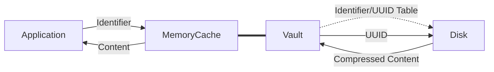

# JsonVault

[](https://www.nuget.org/packages/JsonVault)

Store and cache text data with unique identifier.

## How it works



## Install

Install from [NuGet](https://www.nuget.org/packages/JsonVault/) or get `nupkg` from [GitHub Packages](https://github.com/mkaraki/JsonVault/packages/1663873).

## Usage

```csharp
using (var vault = new JsonVault())
{
  if (File.Exists("vault.json"))
  {
    // Load vault `vault.json`
    await vault.LoadVauldAsync("vault.json");
  }
  else
  {
    // Create Vault `vault.json` (and save files into `files` directory)
    await vault.CreateVaultAsync("vault.json", "files");
  }
  
  // Add content to vault
  await vault.AddAsync("identifier", "{\"Some\":\"Content\"}");
  
  // Get content from vault
  var content = await vault.GetAsync("identifier");
  
  // Add content in vault
  await vault.UpdateAsync("identifier", "{\"Some\":\"Updated Content\"}");
  
  // Delete content from vault
  vault.Delete("identifier");
  
  // Save Vault Metadata
  await vault.SaveVaultAsync();
}
```
